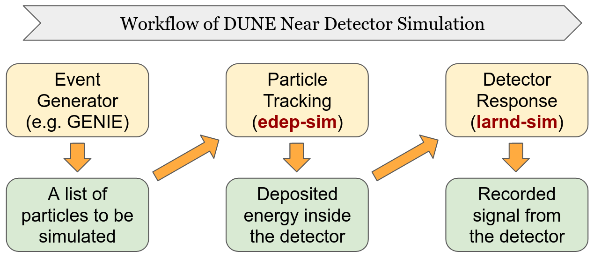

---
jupytext:
  cell_metadata_filter: -all
  formats: md:myst
  text_representation:
    extension: .md
    format_name: myst
    format_version: 0.13
    jupytext_version: 1.10.3
kernelspec:
  display_name: Python 3
  language: python
  name: python3
---

# Introduction
`edep2supera` is a software tool developed for the DUNE near detector (DUNE-ND) collaboration.

Before starting, it is useful to agree-on / introduce some concepts to be on the same page!
* `lartpc_mlreco3d` is a machine learning (ML) based data reconstruction chain. The goal of `edep2supera` is to provide information necessary, called "_labels_", to optimize ML algorithms in `lartpc_mlreco3d` so that it can be used for the DUNE-ND data. 
* `edep2supera` requires input data that is produced from DUNE-ND simulation workflow. In particular, `edep2supera` is designed to take data files generated by `edep-sim` in the diagram below.



Ultimately `lartpc_mlreco3d` should be trained with `larnd-sim` output files which include realistic detector effects. The value of `edep2supera` is to provide:
1. put a foundation of generating labels to optimize the reconstruction chain
2. a benchmark of the reconstruction algorithms without detector effects

In particular, 1 is critical to ensure interpretation of simulated information is correct. This validation allows us to compare the known performance of the reconstruction chain that is trained on the equivalent stage of a simulation (i.e. without detector effects), which has been used to validate the label generation process across experiments.

## Pre-requisites

There are two key points to be aware: how to setup the software stack and how to run `edep-sim` in a way that is compatible with `edep2supera`.

### Software stack 

`edep2supera` requires `larcv2` and `SuperaAtomic` to be installed and built. We strongly recommend users to use a Docker or Singularity software containers prepared by the maintainers of `edep2supera`.

### `edep-sim` file

`edep2supera` (and underlying algorithms) assumes `edep-sim` is run in a certain way to maximize the level of details (and thus amount of) simulation information stored. In particular, when you run `edep-sim`, please make sure to include these lines:

```
/edep/hitSeparation TPCActive_shape -1 mm
/edep/hitSagitta drift 1.0 mm
/edep/hitLength drift 1.0 mm
/edep/db/set/neutronThreshold 0 MeV
/edep/db/set/lengthThreshold 0 mm
/edep/db/set/gammaThreshold 0 MeV
/edep/random/timeRandomSeed
/edep/update
```

The most critical nature required (and enabled above) is that a generated trajectory segment (i.e. `TG4HitSegment` if you wonder) is not shared by multiple particles, and is always asssigned to a unique particle. This helps to disambiguate energy depositions that are otherwise mixed between particles.


## For developers
If you are to develop the code, most likely you would want to install `SuperaAtomic` and `edep2supera`. We recommend you to use the same container described above, then locally install the developer version of these softwares.

### `SuperaAtomic` Installation
The command below will build and install `SuperaAtomic` to your local area (`$HOME/.local`) which is prioritized over the pre-installed one under the system path. 
```
git clone https://github.com/DeepLearnPhysics/SuperaAtomic
cd SuperaAtomic
export SUPERA_WITHOUT_PYTHON=1
python3 setup.py install --user
```

Note you want to set `SUPERA_WITHOUT_PYTHON=1`. Without specifying this, `SuperaAtomic` will be built with `pybind11` which would be incompatible with `edep2supera`. Don't worry: `SuperaAtomic` will still be usable in Python after you build `edep2supera`.

In development, after you modify your code, simply repeat:
```
python3 setup.py install --user
```
(and perhaps you may also have to re-install `edep2supera` if C++ dependent source code has changed).

### `edep2supera` Installation

Similarly, below is how you can install `edep2supera`.
```
git clone https://github.com/DeepLearnPhysics/edep2supera
cd edep2supera
python3 setup.py install --user
```

After you modify the source code, again simply try:
```
python3 setup.py install --user
```
